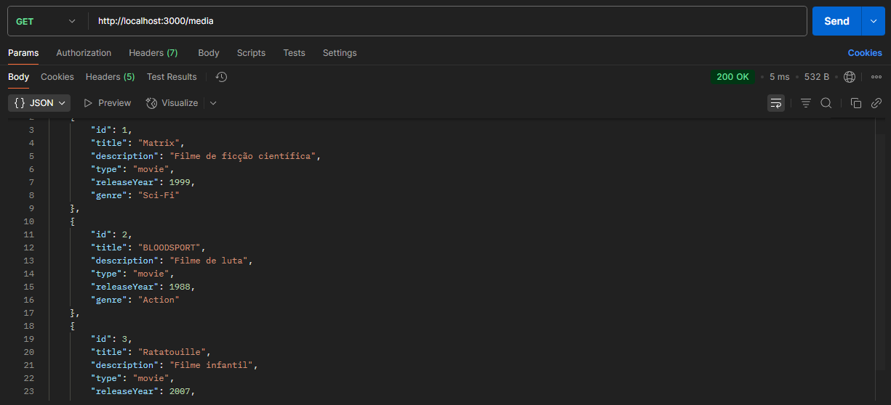
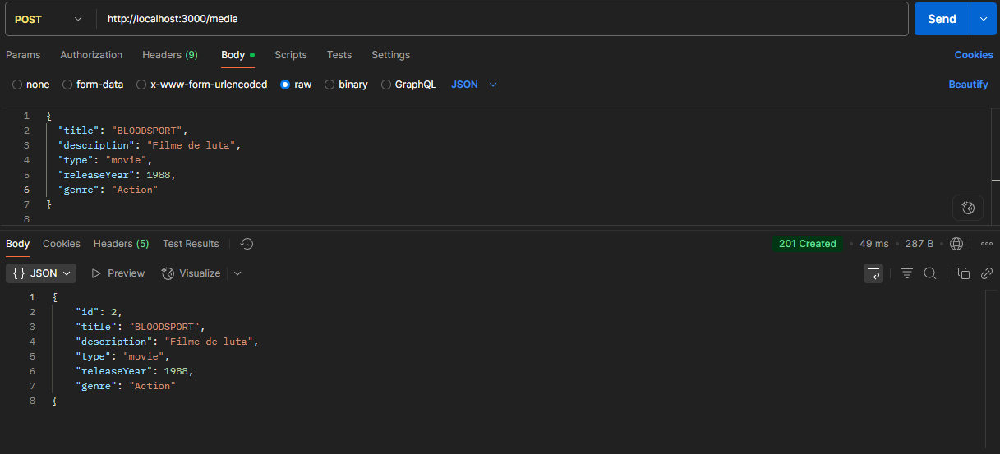
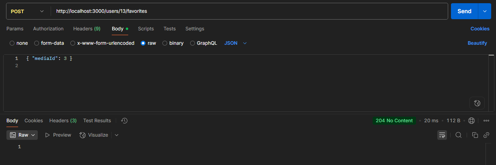
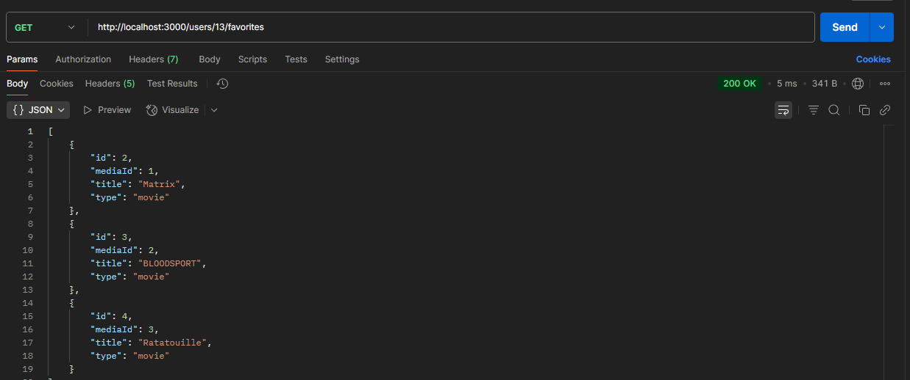
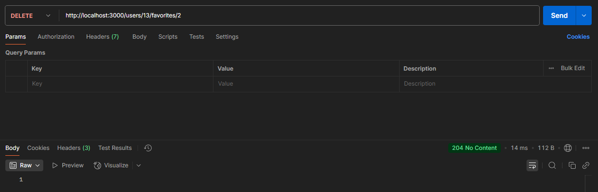

# 🎬 Cinemais API

[](https://nodejs.org/)
[](https://www.typescriptlang.org/)
[](https://www.fastify.io/)
[](LICENSE)

---

## 📝 Descrição do Projeto

Cinemais API é uma API backend para gerenciar um catálogo de mídias (filmes, séries, etc.) e permitir que usuários favoritem conteúdos.  

Principais funcionalidades:
- CRUD de mídias.
- Adicionar, listar e remover favoritos por usuário.
- Validação de dados com Zod.
- Testes automatizados com Jest.
- Padrão de código com ESLint + Prettier.
- Docker para facilitar execução isolada.

---

## ⚡ Justificativa do Framework

O **Fastify** foi escolhido por ser:
- Leve e super rápido.
- Com suporte nativo a TypeScript.
- Simples para criar rotas, middlewares e tratamento de erros.
- Ideal para APIs pequenas e médias, com foco em performance.

---

## 🚀 Rodando Localmente

Para rodar a API localmente, siga os passos:

1️⃣ Clone o repositório:  
```bash
git clone <https://github.com/chrisMartins95/cinemais-api>
cd cinemais-api
```

2️⃣ Instale as dependências:
```bash
npm install
```

3️⃣ Rode o servidor em modo de desenvolvimento:
```bash
npm run dev
O servidor estará disponível em: http://localhost:3000
```
---

## 🐳 Rodando com Docker

1️⃣ Construir a imagem Docker:
```bash
docker build -t cinemais-api .
```

2️⃣ Rodar o container:
```bash
docker run -p 3000:3000 cinemais-api
```

O servidor estará disponível em http://localhost:3000.

⚠️ Observação: Como usamos SQLite, os dados são salvos em arquivo local dentro do container. Se o container for destruído, os dados também serão.

---
## 🧪 Rodando os Testes
O projeto utiliza Jest para testes de integração e unitários.

Rodar todos os testes:
```bash
npm test
```

Rodar testes com cobertura:
```bash
npm run test:coverage
```

---
## 🔗 Endpoints da API

Listar todas as mídias:
```bash
GET /media
```

Exemplo com cURL:
```bash
curl -X GET http://localhost:3000/media
```

Criar nova mídia:
```bash
POST /media
```

Body:
```bash
json
{
  "title": "Filme Exemplo",
  "description": "Descrição do filme",
  "type": "movie",
  "releaseYear": 2023,
  "genre": "ação"
}
```

Exemplo cURL:
```bash
curl -X POST http://localhost:3000/media \
  -H "Content-Type: application/json" \
  -d '{"title":"Filme Exemplo","description":"Descrição do filme","type":"movie","releaseYear":2023,"genre":"ação"}'
```

Adicionar mídia aos favoritos de um usuário:
```bash
POST /users/:userId/favorites
```

Body:
```bash
json
{
  "mediaId": 1
}
```

Exemplo cURL:
```bash
curl -X POST http://localhost:3000/users/1/favorites \
  -H "Content-Type: application/json" \
  -d '{"mediaId":1}'
```

Listar favoritos de um usuário:
```bash
GET /users/:userId/favorites
```

Exemplo cURL:
```bash
curl -X GET http://localhost:3000/users/1/favorites
```

Remover mídia dos favoritos:
```bash
DELETE /users/:userId/favorites/:mediaId
```

Exemplo cURL:
```bash
curl -X DELETE http://localhost:3000/users/1/favorites/1
```

---
## 📸 Exemplos de Requests no Postman

#### Listar todas as mídias


#### Criar nova mídia


#### Adicionar mídia aos favoritos


#### Listar favoritos de um usuário


#### Remover mídia dos favoritos


---
## 🛠 Tecnologias Utilizadas
- Node.js: Runtime JavaScript.

- TypeScript: Tipagem estática.

- Fastify: Framework backend.

- SQLite: Banco de dados leve e local.

- Zod: Validação de dados.

- Jest : Testes unitários e de integração.

- ESLint + Prettier: Padrão de código.

- Docker: Containerização.

---

## 📝 Observações
Esse projeto é voltado para aprendizado e teste técnico.

Os dados do banco SQLite não são persistidos fora do container se estiver usando Docker sem volume.

Para contribuições, siga o padrão de código definido pelo ESLint + Prettier.

Desenvolvido com ❤️ por um júnior que quer aprender e entregar código limpo.